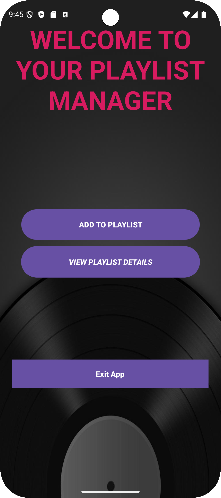
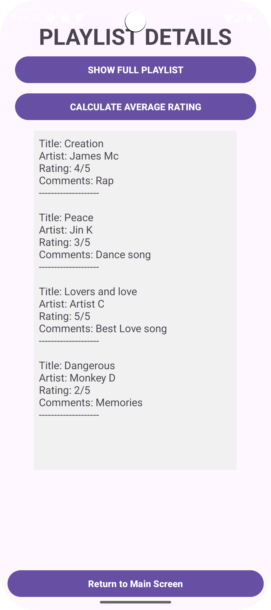

# PlaylistManagerApp
# Playlist Manager Android App

This is a simple Android application created for a simple practicum. It allows users to manage a playlist of songs, including adding new songs, viewing the list, and calculating the average rating of the songs.

**Student Number:** ST10492515
**Full Name:** Jean Baptiste Mwana

## Features

* **Add Songs**: Users can add new songs with a title, artist, rating (1-5), and comments.
* **View Playlist**: Displays all songs in the playlist with their full details.
* **Average Rating**: Calculates and shows the average rating of all songs in the playlist.
* **Screen Navigation**: The app consists of two screens: a main menu and a detailed view.
* **Error Handling**: Provides feedback for invalid user input (e.g., empty fields, incorrect rating).

## How to Run the App

1.  Clone the repository to your local machine.
2.  Open the project in Android Studio.
3.  Build the project to resolve dependencies.
4.  Run the app on an Android emulator or a physical device.

## GitHub Repository

The source code for this project is available on GitHub at the following link:
**https://github.com/Jeankaneki/PlaylistManagerApp.git**

## Screenshots

### Source Code Screenshot

this is the source code of the main screen , it serves us as the welcome screen

this is a screenshot of the source of the detailed view screen, this activity serves us to display all the corresponding details availlable. 
### Main Screen

the main screen as welcome screen that prompts the user to enter the details for a new playlist or view the details of all the existing playlists.
### Detailed View Screen

thanks!